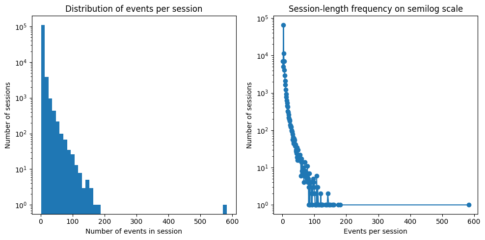
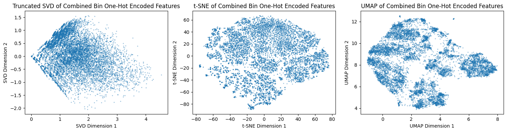
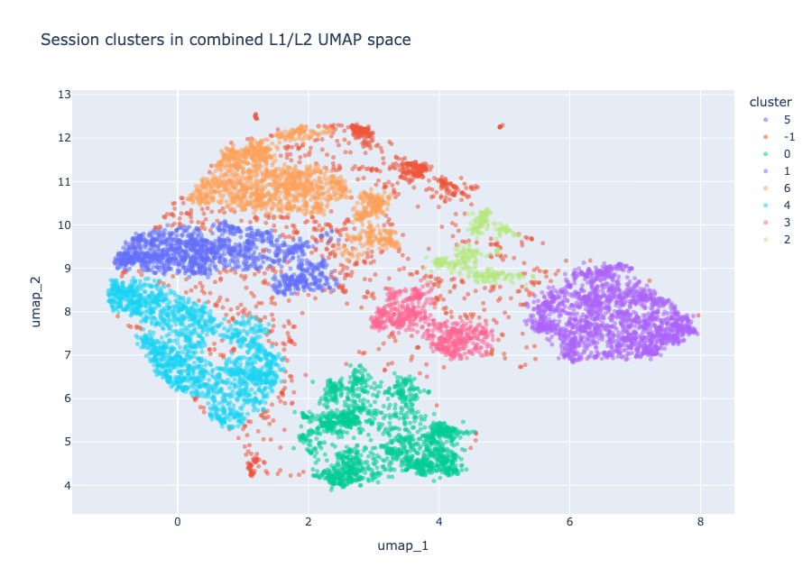
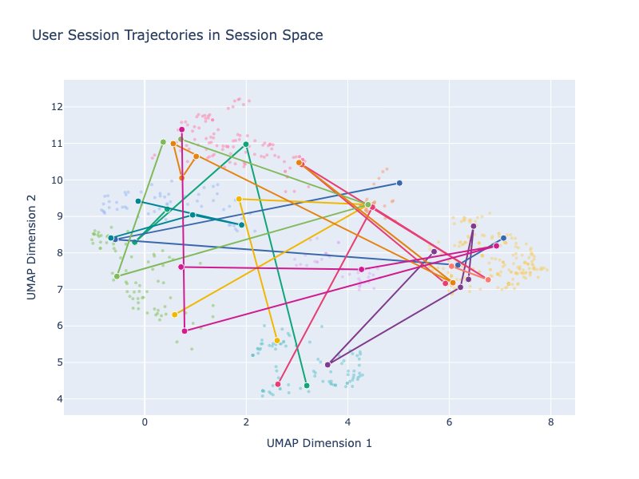
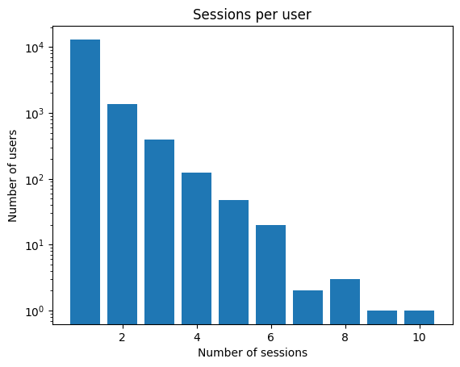

# Google Merch Store Behavior Trajectories

## Slide 1 — Research Question

Can session embeddings reveal underlying user behavior by showing how users move between behavioral states over time?

The hypothesis is that user browsing behavior can be studied as movement through a latent behavioral landscape. Each session is a point in that space, and each user is represented as a trajectory across sessions.

The goal is not only to find session clusters, but to ask whether those clusters form states that users revisit, leave, or explore across sessions.

This work is inspired by *Charting mobility patterns in the scientific knowledge landscape*.

---

## Slide 2 — Data Unit

The raw data is event-level e-commerce tracking data from the Google Merch Store.

The analysis changes the unit of observation:

```text
events -> sessions -> users
```

Sessions are the right unit for embedding because they capture a coherent browsing episode. Users are the right unit for trajectory analysis because movement requires repeated sessions.

---

## Slide 3 — Session Filtering

Very short sessions contain little behavioral information, so sessions with 5 or fewer events were removed before building the embedding space.



This keeps sessions with enough product interaction to describe a browsing pattern.

---

## Slide 4 — URL-Based Session Features

Product behavior is encoded in `page_location`.

The useful product URLs follow this structure:

```text
https://shop.googlemerchandisestore.com/google+redesign/L1/L2
```

Where:

- `L1` is the broad product category
- `L2` is a product, subcategory, brand, or more specific catalog signal

The final session representation uses binary L1 and L2 features:

```text
1 = category/subcategory appeared in the session
0 = it did not appear
```

Binary features were used because the trajectory analysis should focus on what a user touched during a session, not how many times tracking fired for the same item.

---

## Slide 5 — Session Embedding Space

The final embedding combines binary L1 and L2 session features.

UMAP was used to project sessions into two dimensions using cosine distance.



The result is a behavioral map where nearby sessions involve similar catalog interactions.

---

## Slide 6 — Session Behavioral States

HDBSCAN was applied to the UMAP session space.

Final session clustering:

```text
clusters: 7
noise sessions: 11.2%
silhouette: 0.470758

```



The clusters are interpreted as recurring session-level behavioral states, not fixed user personas.

---

## Slide 7 — Session Cluster Profiles

The seven non-noise clusters summarize different browsing patterns:

| Cluster | Interpretation |
|---:|---|
| 0 | Brand-oriented browsing |
| 1 | Apparel and merchandise browsing |
| 2 | Accessories and bags browsing |
| 3 | Stationery and office browsing |
| 4 | Broad multi-category exploration |
| 5 | Lifestyle and stationery browsing |
| 6 | Lifestyle and apparel browsing |

These labels come from the average L1/L2 feature presence inside each cluster.

---

## Slide 8 — User Trajectories

A user trajectory is the ordered path of that user's sessions through the session embedding space.



Each line connects sessions from the same user in chronological order. Movement in this space indicates a change in session behavior.

---

## Slide 9 — Why trajectories are hard?

Most users have only one clustered session.



After removing noise sessions and keeping users with more than 3 usable sessions:

```text
trajectory users: 159
trajectory sessions: 727
```

This is the main limitation of the user-level analysis. Trajectories are informative, but the cohort is small.

---

## Slide 10 — Trajectory Features

For each user, the trajectory notebook computes:

| Feature | Meaning |
|---|---|
| `n_sessions` | Number of usable sessions |
| `cluster_entropy` | How spread the user's sessions are across session clusters |
| `path_length` | Total distance traveled across consecutive sessions |
| `mean_step_distance` | Average movement between consecutive sessions |
| `territory` | Spatial spread of the user's sessions in the embedding space |

The current trajectory score is based on `territory`.

```text
trajectory_score = min-max scaled territory
```

This focuses the user grouping on how wide a behavioral area the user covers.

---

## Slide 11 — User Trajectory Groups

Users are split into three relative groups using the 33rd and 66th percentiles of `trajectory_score`:

| Group | Interpretation |
|---|---|
| `low_spread` | Sessions remain close together |
| `medium_spread` | Moderate movement across the space |
| `high_spread` | Sessions cover a wider behavioral area |

These are exploratory trajectory groups. They should not be interpreted as final personas because most users have only four usable sessions.

---

## Slide 12 — What The Groups Mean

The spread score captures the area covered by a user's sessions.

Support features help validate the grouping:

- higher `path_length` means the user moves more across consecutive sessions
- higher `mean_step_distance` means each session-to-session change is larger
- higher `cluster_entropy` means the user visits a broader mix of session states

The groups therefore describe different levels of behavioral mobility.

---

## Slide 13 — Main Findings

1. Binary L1/L2 session features produce a usable behavioral space.
2. HDBSCAN identifies seven recurring session states with a low noise rate.
3. User trajectory analysis is possible, but only for a small repeat-session cohort.
4. The clearest current user-level signal is trajectory spread: some users stay in a compact behavioral region, while others move across a wider area.
5. The result is exploratory, not a production segmentation model.

---

## Slide 14 — Limitations

The main limitation is repeated user coverage.

Most users do not have enough clustered sessions to support robust trajectory modeling. This makes user-level clustering sensitive to filtering choices and small-sample effects.

The session clusters are stronger than the user trajectory groups because there are many more sessions than repeat-session users.

---
